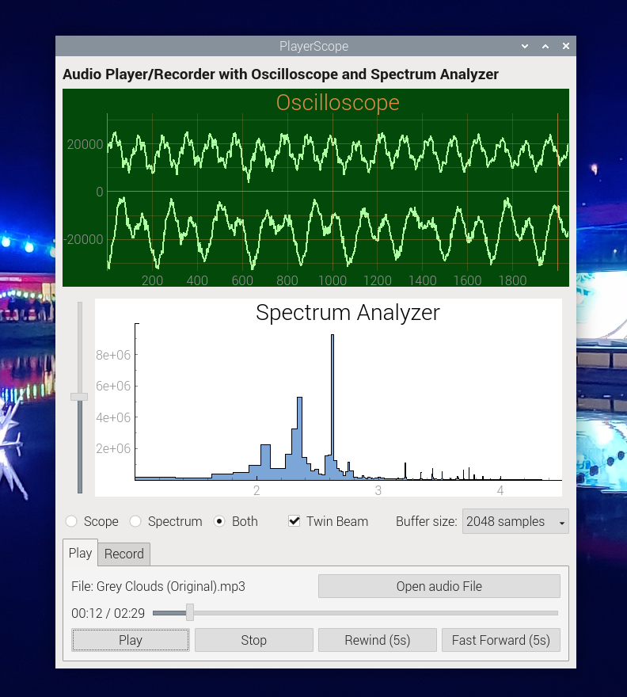

# PlayerScope

Audio Player/Recorder with Oscilloscope and Spectrum Analyzer for Raspberry Pi 3/4/5 Debian Bookworm and similar - python3, pyqt5, pyqtgraph, pyaudio, pydub OR soundfile.

## Screenshot

## Description

I needed an audio player with oscilloscope and spectrum display to run on my Raspberry Pi.  Having failed to find one that worked on the web, I tried to "vibe code" one using AI.  When this didn't work either I ended up writing one myself.  (Bits of the GUI and the soundfile support are still by AI; the rest is human coded.)  I'm putting it on GitHub in case it's useful to anyone else.  But please note that it doesn't currently (30/5/26) work on Pi Debian Trixie; this appears to be due to problems with pyaudio support on Trixie.  It seems to be fine on Debian Bookworm.

## Installing

To install on Debian Bookwork using pydub for audio load and save use install_bookworm.sh.  To attempt to run on Trixie using soundfile for load and save (because pydub doesn't work) try install_trixie.sh, but expect problems (because pyaudio doesn't work either).

## Executing program

Use run.sh

## Limitations

See the comments above regarding issues with pyaudio on Trixie.  I don't think this is PlayerScope's fault, as the elementary program audiotest.py works following first installation of pyaudio on Trixie, but fails following a Pi reboot.  Please let me know if you know a work-round for this!

## Documentation

Inline in the code

## Authors

Dave Parkinson, davep@dhparki.com

## Version History

* 0.5
    * First public release on GitHub

## License

MIT License - Feel free to modify and distribute
